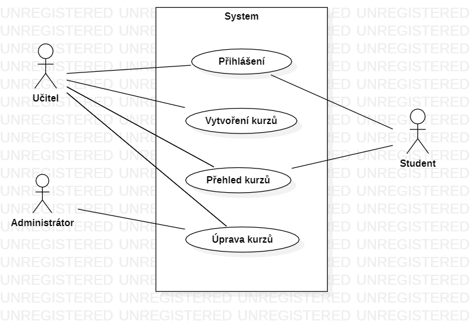

Na začátku se každý přihlásí do své kategorie podle toho jestli se řadí na učitele nebo studenta (to má za úkol příhlášení). Pokud jste učitelem, smíte udělat více věcí. A to je vytvoření kurzu, kde si vymyslíte název kurzu, kolik účastníků se může maximálně zapsat, pro koho je kurz určen. Dále smíte též kurzy upravovat, ať už informace v něm, nebo odebrání účastníků. V přehledu kurzu, jak učitelé tak i studenti uvidí, jaké jsou volby kurzu a kolik je volných míst. Administrátor se poté stará o vzhled stránky, přihlášení a obecně jakékoliv úpravy celé aplikace.

 
	

